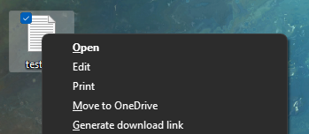

# Generate a download link for a file from the context menu

The file will be uploaded to [bayfiles.com](https://bayfiles.com) and a download link will be copied to the clipboard.

Restrictions:

- Max 20 GB per file
- Max 500 files or 50 GB per hour
- Max 5,000 files or 100 GB per day

There are no restrictions on downloads.

## Building from source

1. Make sure you have [Rust](https://www.rust-lang.org/tools/install) installed and up to date.
2. Clone the repository and run `cargo build --release` to build the executable.

### Building the MSI installer

1. Install the [WiX toolset](https://wixtoolset.org/). I recommend using [Scoop](https://scoop.sh/): `scoop install wixtoolset`. It will automatically install the latest version and add the binaries to your `Path`. Alternatively, download the WiX toolset from <https://wixtoolset.org/releases/> and add the `bin` folder to your `Path` manually.
2. Install `cargo-wix`: run `cargo install cargo-wix`
3. Run `cargo wix` to build the installer (add the `--install` flag to run the installer after building).

The installer will be created in `target/wix`.
The installer can be customized by editing the `wix/main.wxs` file. See the [WiX toolset documentation](https://wixtoolset.org/documentation/).
